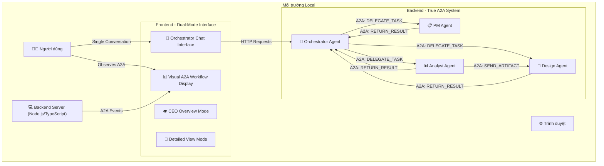

````markdown
# Fullstack Architecture: Agent Flow

### **High Level Architecture (Kiến trúc Cấp cao)**

#### **Tóm tắt Kỹ thuật**

Dự án "Agent Flow" sẽ được phát triển dưới dạng một ứng dụng web full-stack, chạy trên môi trường local. Kiến trúc sẽ theo mô hình **monorepo**, chứa ứng dụng frontend **Next.js** và backend **Node.js/TypeScript**. Backend sẽ mô phỏng một **Hệ thống Đa Tác tử (Multi-Agent System)** theo kiến trúc **Phân cấp (Hierarchical)**, nơi một tác tử chính điều phối các tác tử chuyên biệt khác. Giao tiếp giữa frontend và backend, cũng như giữa các tác tử, sẽ tuân thủ hoặc mô phỏng giao thức A2A của Google.

#### **Sơ đồ Kiến trúc Cấp cao**


````

#### **Các Mẫu Kiến trúc (Architectural Patterns)**

- **Monorepo:** Sử dụng một kho chứa code duy nhất để quản lý cả frontend, backend và các thư viện chia sẻ, giúp đồng bộ và nhất quán.
- **Centralized Orchestration Pattern:** Một Orchestrator Agent duy nhất làm điểm tương tác với người dùng và tự động điều phối toàn bộ workflow với các specialist agents thông qua True A2A Communication.
- **Dual-Mode UI Pattern:** Frontend hỗ trợ hai chế độ xem với khả năng mở rộng chi tiết:
  - **CEO Overview Mode:** Giao diện đơn giản, tập trung vào sơ đồ tổ chức và metrics cấp cao cho executive stakeholders
    - **Individual Agent Expansion:** Click vào agent cards để xem chi tiết với UI giống Detailed View
    - **Consistent Component Reuse:** Sử dụng chung ChatInterface, TaskDisplay, ArtifactDisplay components
  - **Detailed View Mode:** Giao diện đầy đủ chức năng với chat interfaces, artifact management cho technical stakeholders
    - **Expandable Agent Cards:** Click để mở rộng thông tin chi tiết của từng agent
    - **Orchestrator Integration:** OrchestratorChat component được tích hợp trong expanded view
- **Observer Pattern cho A2A Transparency:** Người dùng có thể quan sát nhưng không can thiệp vào quá trình A2A giữa các agents.
- **Delegation Pattern:** Orchestrator phân tích requests và tự động giao nhiệm vụ cho appropriate specialist agents.
- **Result Synthesis Pattern:** Orchestrator tự động thu thập và tổng hợp kết quả từ tất cả specialist agents trước khi trình bày cho người dùng.
- **Conditional Rendering Pattern:** UI components được render có điều kiện dựa trên view mode để tối ưu performance và user experience.
- **Expandable Component Pattern:** Agent cards có thể được mở rộng để hiển thị chi tiết với state management hiệu quả (expandedAgents Set<string>).
- **Component Reusability Pattern:** Expanded details trong CEO mode sử dụng chính xác các components giống như Detailed View để đảm bảo tính nhất quán UI.
- **Server-Side Rendering (SSR) với Next.js:** Tận dụng khả năng của Next.js để có cấu trúc dự án rõ ràng.
- **Sử dụng mẫu `AgentExecutor`:** Đóng gói logic cốt lõi của mỗi tác tử vào một `class` riêng biệt theo mẫu `AgentExecutor` từ `A2A-JS SDK`.

### **Technology Stack Table (Bảng Công nghệ)**

| Hạng mục               | Công nghệ    | Phiên bản (Đề xuất) | Mục đích                                  | Lý do Lựa chọn                                  |
| :--------------------- | :----------- | :------------------ | :---------------------------------------- | :---------------------------------------------- |
| **Monorepo Tool**      | Turborepo    | \~1.13              | Quản lý kho code chung (monorepo)         | Tối ưu cho các dự án JavaScript/TypeScript.     |
| **Frontend Language**  | TypeScript   | \~5.4               | Ngôn ngữ phát triển chính cho frontend    | Tích hợp sẵn với Next.js, an toàn kiểu dữ liệu. |
| **Frontend Framework** | Next.js      | \~15.3.4            | Khung sườn chính để xây dựng giao diện    | Lựa chọn của bạn, hệ sinh thái mạnh mẽ.         |
| **UI Library**         | Tailwind CSS | \~3.4               | Cung cấp các lớp CSS tiện ích để tạo kiểu | Xây dựng giao diện nhanh, nhất quán.            |
| **UI Components**      | shadcn/ui    | \~0.8               | Bộ sưu tập các component giao diện        | Dễ cài đặt, tùy chỉnh, chuẩn truy cập.          |
| **State Management**   | Zustand      | \~4.5               | Quản lý trạng thái giao diện người dùng   | Nhẹ, đơn giản và hiệu quả cho demo.             |
| **Backend Language**   | TypeScript   | \~5.4               | Ngôn ngữ phát triển chính cho backend     | Đồng bộ ngôn ngữ với frontend.                  |
| **Backend Framework**  | Express.js   | \~4.19              | Tạo và quản lý các API endpoint           | Nhẹ, phổ biến, đủ mạnh mẽ cho backend.          |
| **API Style**          | JSON-RPC 2.0 | 2.0                 | Giao thức giao tiếp cho A2A               | Tuân thủ theo đặc tả của A2A.                   |
| **Database**           | SQLite       | \~5.1               | Lưu trữ dữ liệu đơn giản ở local          | Không cần cài đặt server, tiện cho demo.        |
| **Testing Framework**  | Jest & RTL   | \~29.7              | Viết và chạy unit test, component test    | Tiêu chuẩn trong hệ sinh thái React/Next.js.    |
| **Runtime**            | Node.js      | \~20.11 (LTS)       | Môi trường để chạy backend TypeScript     | Phiên bản ổn định (LTS).                        |

### **Source Tree (Cấu trúc Thư mục)**

```plaintext
agent-flow/
├── .github/
│   └── workflows/
├── apps/
│   ├── api/
│   │   ├── src/
│   │   │   ├── agents/
│   │   │   ├── core/
│   │   │   ├── routes/
│   │   │   └── index.ts
│   │   ├── package.json
│   │   └── tsconfig.json
│   └── web/
│       ├── app/
│       ├── components/
│       ├── lib/
│       ├── public/
│       ├── package.json
│       └── tsconfig.json
├── packages/
│   ├── config/
│   │   ├── eslint-preset.js
│   │   └── tsconfig.json
│   └── shared/
│       ├── src/
│       │   ├── types/
│       │   └── index.ts
│       └── package.json
├── .env.example
├── .gitignore
├── package.json
└── turborepo.json
```

### **Data Models (Mô hình Dữ liệu - Cập nhật theo A2A-JS SDK)**

#### **Agent & AgentCard**

```typescript
interface AgentCard {
  name: string;
  description: string;
  url: string;
  provider: {
    organization: string;
    url: string;
  };
  version: string;
  capabilities: {
    streaming: boolean;
    pushNotifications: boolean;
    stateTransitionHistory: boolean;
  };
  skills: Skill[];
}

interface Skill {
  id: string;
  name: string;
  description: string;
}
```

#### **Message (Tin nhắn)**

```typescript
interface Message {
  id: string;
  sender: "user" | string; // user hoặc agent_id
  content: string;
  timestamp: Date;
}
```

#### **Task (Tác vụ)**

```typescript
type TaskStatus = "pending" | "in-progress" | "completed" | "failed";

interface Task {
  id: string;
  title: string;
  status: TaskStatus;
  assigner: string; // agent_id
  assignee: string; // agent_id
  createdAt: Date;
}
```

#### **Artifact (Hiện vật)**

```typescript
type ArtifactType = "markdown" | "image/png" | "json";

interface Artifact {
  id: string;
  name: string;
  type: ArtifactType;
  contentUrl: string;
  creator: string; // agent_id
  createdAt: Date;
}
```

#### **DemoSession (Phiên làm việc)**

```typescript
interface DemoSession {
  id: string;
  status: "active" | "completed";
  messages: Message[];
  tasks: Task[];
  artifacts: Artifact[];
  log: string[];
}
```
