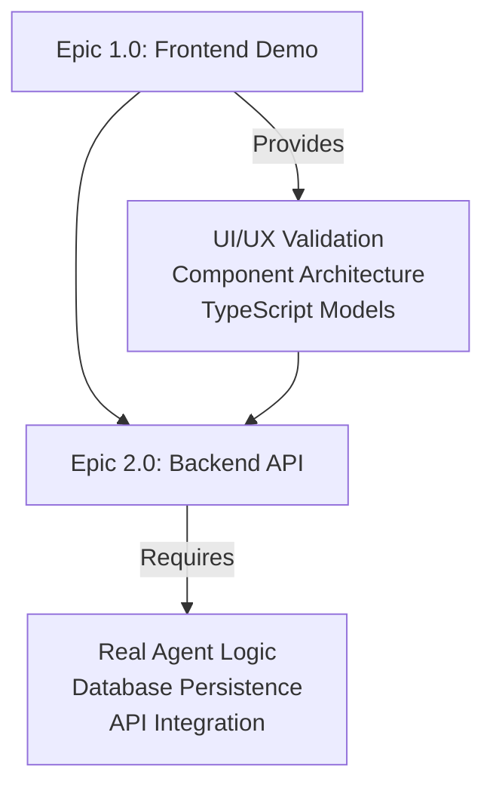

# A2A Demo Flow - Epics Overview

This directory contains detailed specifications for all project epics, providing comprehensive planning and tracking for the A2A Demo Flow project.

## Epic Structure

### 📁 **Epic 1.0: Frontend Demo Foundation** - ✅ COMPLETED

**File**: [`epic-1.0-frontend-demo-foundation.md`](./epic-1.0-frontend-demo-foundation.md)  
**Status**: Completed July 1, 2025  
**Goal**: Build MVP frontend demonstration of A2A workflows  
**Stories**: 1.1 - 1.5 (All completed)

**Key Achievements**:

- ✅ Visual workbench interface with agent areas
- ✅ Task creation and assignment workflows
- ✅ Artifact creation, transfer, and display
- ✅ Autonomous agent processing simulation
- ✅ Orchestrator-only interaction model

### 📁 **Epic 2.0: Backend API Foundation** - 📋 PLANNING

**File**: [`epic-2.0-backend-api-implementation.md`](./epic-2.0-backend-api-implementation.md)  
**Status**: Planning phase  
**Goal**: Implement production-ready backend with real A2A processing  
**Stories**: 2.1 - 2.7 (Planned)

**Planned Deliverables**:

- 🔧 Express.js API server with JSON-RPC 2.0
- 🗄️ SQLite database with proper schema
- 🤖 Real agent processing logic
- 🔄 WebSocket real-time communication
- 🔗 Frontend API integration
- 🔒 Authentication and security
- 🚀 Production deployment setup

## Epic Dependencies

## Epic Timeline

| Epic         | Status       | Duration   | Key Milestones                             |
| ------------ | ------------ | ---------- | ------------------------------------------ |
| **Epic 1.0** | ✅ Completed | 4 weeks    | Stories 1.1-1.5 delivered                  |
| **Epic 2.0** | 📋 Planning  | 8-12 weeks | Backend foundation → Real A2A → Production |

## Epic Success Metrics

### Epic 1.0 Results ✅

- **User Experience**: Professional demo interface validating A2A concepts
- **Technical Foundation**: Component architecture ready for backend integration
- **Stakeholder Value**: Tangible demonstration of multi-agent collaboration
- **Business Validation**: Proof of concept for A2A workflow automation

### Epic 2.0 Targets 🎯

- **Performance**: <100ms API response times, <200ms real-time updates
- **Reliability**: 99.9% uptime, comprehensive error handling
- **Scalability**: Architecture supporting multiple concurrent users
- **Security**: Production-ready authentication and data protection

## Quality Gates

### Epic 1.0 → Epic 2.0 Transition ✅

- [x] All frontend stories completed and tested
- [x] Architecture gap analysis documented
- [x] Backend requirements specification created
- [x] Team understanding of migration complexity

### Epic 2.0 Phases

- **Phase 1**: Backend foundation (Stories 2.1-2.2)
- **Phase 2**: Agent logic implementation (Story 2.3)
- **Phase 3**: Integration and real-time (Stories 2.4-2.5)
- **Phase 4**: Production readiness (Stories 2.6-2.7)

## Risk Management

### Epic 1.0 Lessons Learned

- ✅ **Frontend-first approach** enabled rapid validation
- ⚠️ **Architecture gap** emerged late in development
- ✅ **Component design** proved scalable and maintainable
- ⚠️ **Backend planning** should have started earlier

### Epic 2.0 Risk Mitigation

- **High Risk**: Frontend refactoring complexity → Incremental migration strategy
- **Medium Risk**: Database schema design → Extensive review and testing
- **Low Risk**: Technology integration → Proven libraries and patterns

## Next Steps

### Immediate (Week 1)

1. **Epic 2.0 Approval**: Stakeholder review and sign-off
2. **Team Preparation**: Backend development environment setup
3. **Story 2.1 Planning**: Detailed breakdown and task assignment
4. **Architecture Review**: Final validation of backend design

### Short Term (Weeks 2-4)

1. **Story 2.1 Implementation**: Backend API server foundation
2. **Story 2.2 Implementation**: Database schema and models
3. **Epic 1.0 Maintenance**: Bug fixes and demo enhancements
4. **Story 2.3 Planning**: Agent logic design and breakdown

### Medium Term (Weeks 5-8)

1. **Story 2.3 Implementation**: Real agent processing logic
2. **Story 2.4 Planning**: Real-time communication design
3. **Frontend Migration Planning**: API integration strategy
4. **Testing Strategy**: Comprehensive test plan development

---

**Document Owner**: Product Owner Sarah  
**Last Updated**: July 1, 2025  
**Next Review**: Weekly during Epic 2.0 implementation

## Quick Navigation

- 📋 **Current Planning**: [Epic 2.0 Specification](./epic-2.0-backend-api-implementation.md)
- ✅ **Completed Work**: [Epic 1.0 Summary](./epic-1.0-frontend-demo-foundation.md)
- 📖 **Project Documentation**: [`../README.md`](../README.md)
- 🎯 **Product Requirements**: [`../prd.md`](../prd.md)
- 🏗️ **Architecture**: [`../architecture.md`](../architecture.md)
